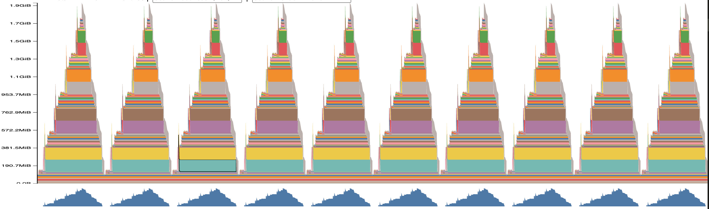
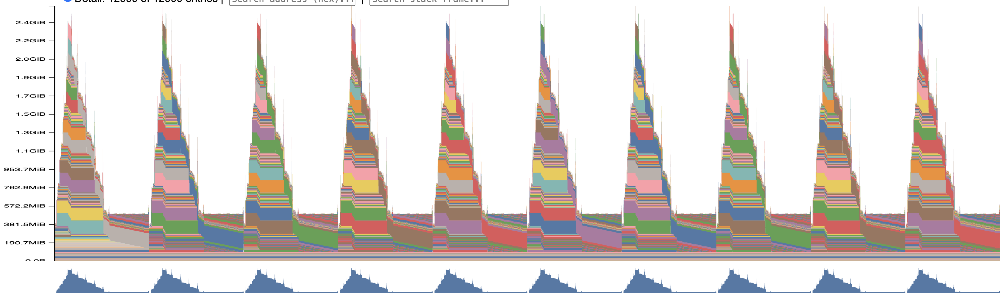

## Problem: Benchmarking Script

Using the default model settings

- forward
```
Benchmarking forward mode...
Time taken: 0.020201002713292837 seconds per iteration
Variance: 4.503222838939461e-09
Standard deviation: 6.710605664870692e-05
```

- forward + backward
```
Benchmarking forward_backward mode...
Time taken: 0.07003293894231319 seconds per iteration
Variance: 3.944476621567384e-08
Standard deviation: 0.00019860706486848307
```

- forward + backward + optimizer step
```
Benchmarking forward_backward_optimizer_step mode...
Time taken: 0.07332581151276826 seconds per iteration
Variance: 8.011134572070976e-09
Standard deviation: 8.95049416069916e-05
```

The warmup is critical to reduce the variance, if we skip the warmup stage, the reported time and variance would be much higher
- forward, no warmup
```
Benchmarking forward mode...
Time taken: 0.05068178568035364 seconds per iteration
Variance: 0.008258084730262794
Standard deviation: 0.09087400470025954
```

## Problem: Nsight System Profiling

Use the same default model config as the pervous one

The forward time is around 16ms, with additional 4ms on the cuda event sync, which is aligned with the number in the above benchmarking script.

On the hardware I'm experiment with (RTX 3090, using Ampere Cuda Core), the most time consuming kernel is `ampere_sgemm_128x64_tn` kernel, which takes 33.4%, get invoked for 29 times in a single forward. In foward_backward, this kernel is still the most time consuming one, but the ratio drops to 9.6%, and the invoked time is still 29 times.

There is some other kernel taking majority of time as well. Some elementwise kernel is also taking some time, this is especially obvious in forward backward pass, for example
```
Time	Total Time	Instances	Avg	Med	Min	Max	StdDev	Name
9.6%	6.758 ms	29	233.036 μs	124.224 μs	122.657 μs	2.004 ms	344.816 μs	ampere_sgemm_128x64_tn
8.7%	6.098 ms	68	89.680 μs	31.776 μs	1.408 μs	476.418 μs	143.101 μs	void at::native::vectorized_elementwise_kernel<(int)4, at::native::BinaryFunctor<float, float, float, at::native::binary_internal::MulFunctor<float>>, std::array<char *, (unsigned long)3>>(int, T2, T3)   
```

The fraction of time spend on matrix mulitiplication drops compare a full training step vs inference only step.

(Note the following is computed over RTX 4500 which is using blackwell tensor core)
In the current profling result, if we ignore the `aten:where`, the breakdown of time is as follow:
- compute attention scores: 235.5 us
- compute softmax: 164.4 us
- compute output: 231.117 us

Compre to their FLOPs (bsz: 4, d_model: 512, d_ff: 1024, context_length: 1024, num_heads: 8, d_k: 64):
- compute attention scores: `bsz x 2 x seq x d_k x seq` = 536M
- compute softmax: `bsz x seq x seq` = 4M
- compute output: `bsz x 2 x seq x seq x d_v` = 546M

From the computation, the attention scores and output FLOPs is idential given the matrix multiplication is similar; however, softmax FLOPs is much lower given its elementwise computation property, but the nsys profiling result shows its much higher than expected.

## Problem: Mixed Precision Accumulation

The program output is as follow

```
tensor(10.0001)
tensor(9.9531, dtype=torch.float16)
tensor(10.0021)
tensor(10.0021)
```

It shows that using `torch.float16` has the underflow issue, where the cumulatived result is lower than the expected one; while represent the value in `torch.float16` and cumulative into `torch.float32` shows overflow, the cumulatived value is higher.

```
model parameters dtype: torch.float32
fc1 output dtype: torch.float16
ln output dtype: torch.float32
model prediction dtype: torch.float16
loss dtype: torch.float32
model parameters gradient dtype: torch.float32
```

LayerNorm needs to compute the norm for normalization, which is sensitive and need higher precision to avoid the cumulative error similar to the result above. Also FP16's range is too limited and could cause underflow or overflow issue. Also LayerNorm is elementwise operation and could not best leverage Tensor Cores. Change to BF16 does not resolve the issue, although its range is the save as FP32, but the precision is lower than FP16 and would still have the cumulative error.

Under the original model setup, there is no big difference in the model forward pass, and the bf16 is even slightly slower than fp32. However, once we scale up to (bsz 32, d_model 1024, d_ff 4196), ther bf16 and fp32 has relative large performance difference.

The fp32 forward pass is around 378ms, and the matrix multi kernel is taking 6.4ms on average
```
Time	Total Time	Instances	Avg	Med	Min	Max	StdDev	Name
47.8%	180.424 ms	28	6.444 ms	2.710 ms	2.675 ms	12.386 ms	4.429 ms	void cutlass::Kernel2<cutlass_80_simt_sgemm_128x256_8x4_tn_align1>(T1::Params)
```

While for the bf16 version, the forward pass is around 164ms, and the matrix multi kernel is taking 2.2 ms on average
```
Time	Total Time	Instances	Avg	Med	Min	Max	StdDev	Name
16.1%	26.478 ms	12	2.207 ms	2.174 ms	2.136 ms	2.312 ms	69.023 μs	void cutlass::Kernel2<cutlass_80_tensorop_bf16_s16816gemm_bf16_128x256_32x3_tn_align2>(T1::Params)
```

## Problem: Memory Profiling

Command

- forward, context length 1024
`uv run python cs336_systems/benchmarking_script.py --mode forward --enable_memory_profiling true`



- forward + backward + optimizer, context length 1024
`uv run python cs336_systems/benchmarking_script.py --mode forward_backward_optimizer_step --enable_memory_profiling true`



Peak memory of forward: 1.9G
Peak memory of forward + backward + optimizer: 2.6G

- forward, context length 1024, mixed precision
`uv run python cs336_systems/benchmarking_script.py --mode forward --enable_memory_profiling true --dtype bfloat16`

Peak memory: 1.4G

- forward + backward + optimizer, context length 1024, mixed precision
`uv run python cs336_systems/benchmarking_script.py --mode forward_backward_optimizer_step --enable_memory_profiling true --dtype bfloat16`

Peak memory: 2.0G

Yes, the mixed precision affect the memory usage a lot, not only the compute kernel is more efficient, but the activation size is also reduced

Also, from the computation, the spike of the memory comes from the softmax computation, where we would have a activation of size `bsz x num_head x seq x seq x dtype`.

The size of the residual stream is essentially the input of shape `bsz x seq x d_model`, in the current setup with single precison, this gives `4 x 1024 x 512 x 4 = 8MB`

128MB is the largest allocation, and it comes from softmax computation.

`uv run nsys profile --trace=cuda,cudnn,cublas,osrt,nvtx --pytorch=functions-trace,autograd-shapes-nvtx --cudabacktrace=all --python-backtrace=cuda -- python cs336_systems/benchmarking_script.py --mode forward_backward_optimizer_step --enable_memory_profiling true --dtype bfloat16`

`uv run nsys profile --trace=cuda,cudnn,cublas,osrt,nvtx --pytorch=functions-trace,autograd-shapes-nvtx --cudabacktrace=all --python-backtrace=cuda --cuda-memory-usage=true -- python cs336_systems/benchmarking_script.py --mode forward_backward_optimizer_step`

But from my trace, there is not obvious change in the memory usage during the `forward_backward_optimize` step. The memory starts to cumulative to maximize of 3GB and then stay static and not freed; my hypothesis is that this is due to Pytorch memory allocator.

`uv run nsys profile --trace=cuda,cudnn,cublas,osrt,nvtx --pytorch=functions-trace,autograd-shapes-nvtx --cudabacktrace=all --python-backtrace=cuda --cuda-memory-usage=true -- python cs336_systems/benchmarking_script.py --mode forward_backward`

## Problem: Activation Checkpoint

Vanila way to checkpoint each block does not reduce the complexity, block 1 would depends on block 0's output and resursively. Thus although each block's intermediate activation is reduced, the overall activation is still of `O(N)`.

A better way is to use nested checkpoint, and wrap the blocks recursively to minimize the peak memory. This is similar to a balanced binary tree, where is the smallest tree hight, which is exact the peak memory (stack). This would give a `O(logN)` peak memory scale.

> PS: without checkpoint, the sequential run with 16 blocks would have CUDA OOM issue on RTX 4500

| N  | Peak memory (MiB) | Increment |
|----|-------------------|-----------|
| 4  |  9951.93          | -         |
| 8  | 13173.08          |           |
| 16 | 19615.40          |           |


If the nested checkpoint is not allowed, then we could use `sqrt(N)` blocks to warp
